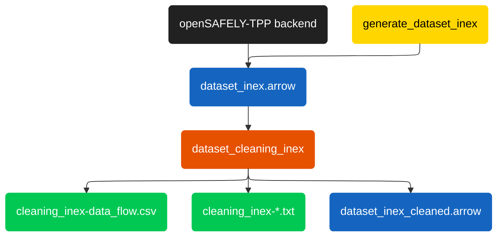

# Project Pipeline

This diagram pictorially represents the flow through the project 

## Diagram

## Legend

| Colour | Type |
|--------|------|
| ⬛ | OpenSAFELY-TPP input |
| 🟨 | ehrQL action |
| 🟧 | R script |
| 🟦 | Data file |
| 🟩 | Output file |